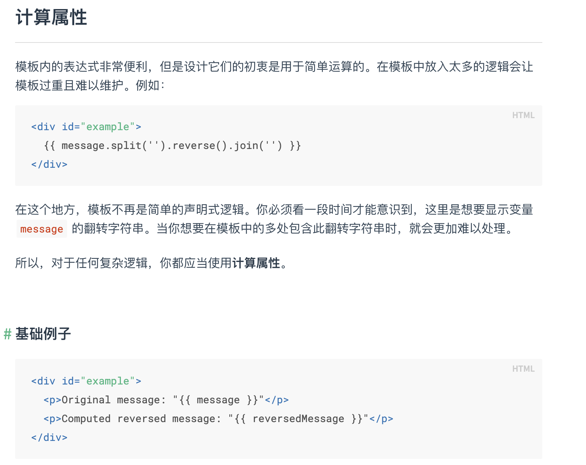
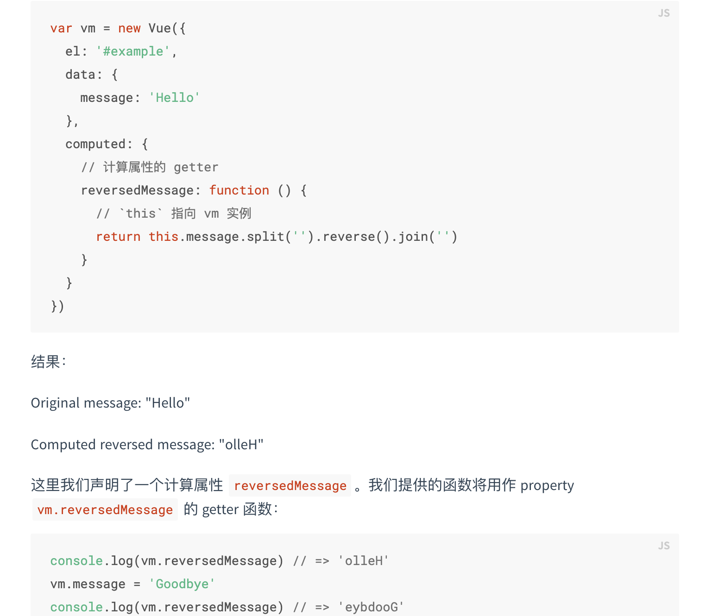
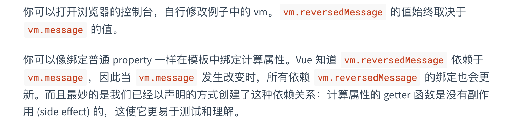

# HTML

## 怎么理解H5语义化

语义化的含义就是用正确的标签做正确的事情。例如，头部就用header，底部就用footer，导航就用nav，边栏就用aside
让代码的结构有可读性。

## HTML里meta的作用

一般都定义了html页面的元数据，例如网页的keywords，author，description。
其他的不怎么了解，用的最多的就是`<meta name="viewport" content="width=device-width, initial-scale=1.0">`

# CSS

## 盒子模式

- 标准盒子模型  box-sizing:content-box
- 怪异盒子模型  border-box

## px和rem和em的区别

1. px是相对长度单位，它是相对于显示器屏幕分辨率而言的。

优缺点：比较稳定和bai精确，但在浏览器中放大或缩放浏览页面时会出现页面混乱的情况。

2. em是相对长度单位，EM是相对于父元素来设计字体大小的。如果当前对行内文本的字体尺寸未被人为设置，则相对于浏览器的默认字体尺寸。

优缺点：em的值并不是固定的，它会继承父级元素的字体大小。

3. rem是CSS3新增的一个相对单位，REM是相对单位，是相对HTML根元素。

这个单位可谓集相对大小和绝对大小的优点于一身，通过它既可以做到只修改根元素就成比例地调整所有字体大小，又可以避免字体大小逐层复合的连锁反应。

## vw和vh

视口，即浏览器屏幕大小，1vw 等于浏览器宽度的 1%，100vw 即整个浏览器的宽度

- vw --- 1vw 等于视口宽度的 1%
- vh --- 1vh 等于视口高度的 1%
- vmin --- vw 和 vh 中的较小值
- vmax --- vw 和 vh 中的较大值

## 常用的css选择器

id选择器，类选择器，属性选择器（`a[href] {color:red;}`，只对有 href 属性的锚（a 元素）应用样式）
伪类选择器，一般常用的有 :nth-child(), :hover
后代选择器 div a

## 定位

relative 相对于自身定位
absolute 如果他的父元素有相对定位，那么就是根据父元素定位，如果没有，那么就是根据浏览器的窗口
fixed    根据浏览器的窗口定位

## BFC

BFC是一个独立的布局环境，其中的元素布局是不受外界的影响，并且在一个BFC中，块盒与行盒（行盒由一行中所有的内联元素所组成）都会垂直的沿着其父元素的边框排列。
BFC就是页面上的一个隔离的独立容器，容器里面的子元素不会影响到外面的元素

## 怎么开启BFC

1. float的值不是none。
2. position的值为absolute或者fixed
3. display的值是inline-block、table-cell、flex、table-caption或者inline-flex
4. overflow：hidden

## BFC有什么作用

1. 利用BFC避免margin重叠
2. 清除浮动
当我们不给父节点设置高度，子节点设置浮动的时候，会发生高度塌陷，这个时候我们就要清除浮动

## 水平垂直居中的方式

1. 利用display：flex 然后 justify-content：center 和 align-items：center
2. 相对定位加绝对定位，父元素加相对定位，子元素加绝对定位

```CSS
left:0;
right:0;
top:0;
bottom:0;
margin:auto;
position:absolute
```

3. 定位 + margin-top + margin-left  (要知道自身的宽高)

```CSS
.box-container{
    position: relative;
    width: 300px;
	height: 300px;
}
.box-container .box {
	width: 200px; 
    height: 100px;
    position: absolute; 
    left: 50%; 
    top: 50%;
    margin-top: -50px;    /* 高度的一半 */
    margin-left: -100px;    /* 宽度的一半 */
```

4. transform方案 （存在兼容问题）
在子元素上设置，transform: translate(-50%, -50%);  用于平面的2D转换，后面的百分比以自身的宽高为参考，定位后将元素的左上角置于父级中央，之后再用 transform 进行偏移，相当于上面设置的 margin-top 和 margin-left

```CSS
.box {
        position: relative; 
        left: 50%; 
        top: 50%;
        transform: translate(-50%, -50%);    

```

## CSS的引用，link和import的区别

link：使用链接式时与导入式不同的是它会以网页文件主体装载前装载CSS文件，因此显示出来的网页从一开始就是带样式的效果的，它不会象导入式那样先显示无样式的网页，然后再显示有样式的网页，这是链接式的优点

@import：导入式会在整个网页装载完后再装载CSS文件，因此这就导致了一个问题，如果网页比较大则会儿出现先显示无样式的页面，闪烁一下之后，再出现网页的样式。这是导入式固有的一个缺陷

link引用CSS时，在页面载入时同时加载；@import需要页面网页完全载入以后加载

# JS

## 常见的数组方法

- push() 方法将一个或多个元素添加到数组的末尾，并返回该数组的新长度
- filter() 方法创建一个新数组, 其包含通过所提供函数实现的测试的所有元素

```Javascript
const words = ['spray', 'limit', 'elite', 'exuberant', 'destruction', 'present'];

const result = words.filter(word => word.length > 6);

console.log(result);
// expected output: Array ["exuberant", "destruction", "present"]

```

- findIndex()方法返回数组中满足提供的测试函数的第一个元素的索引。若没有找到对应元素则返回-1

```Javascript
const array1 = [5, 12, 8, 130, 44];

const isLargeNumber = (element) => element > 13;

console.log(array1.findIndex(isLargeNumber));
// expected output: 3
```

- find() 方法返回数组中满足提供的测试函数的第一个元素的值。否则返回 undefined; 它返回数组中找到的元素的值，而不是其索引

```Javascript
const array1 = [5, 12, 8, 130, 44];

const found = array1.find(element => element > 10);

console.log(found);
// expected output: 12
```

- keys() 方法返回一个包含数组中每个索引键的Array Iterator对象

```Javascript
const array1 = ['a', 'b', 'c'];
const iterator = array1.keys();

for (const key of iterator) {
  console.log(key);
}

// expected output: 0
// expected output: 1
// expected output: 2

```

- map() 方法创建一个新数组，其结果是该数组中的每个元素是调用一次提供的函数后的返回值

```Javascript
const array1 = [1, 4, 9, 16];

// pass a function to map
const map1 = array1.map(x => x * 2);

console.log(map1);
// expected output: Array [2, 8, 18, 32]

```

- reduce() 方法对数组中的每个元素执行一个由您提供的reducer函数(升序执行)，将其结果汇总为单个返回值

```Javascript
const array1 = [1, 2, 3, 4];
const reducer = (accumulator, currentValue) => accumulator + currentValue;

// 1 + 2 + 3 + 4
console.log(array1.reduce(reducer));
// expected output: 10

// 5 + 1 + 2 + 3 + 4
console.log(array1.reduce(reducer, 5));
// expected output: 15
```

- splice() 方法通过删除或替换现有元素或者原地添加新的元素来修改数组,并以数组形式返回被修改的内容。此方法会改变原数组

```Javascript
const months = ['Jan', 'March', 'April', 'June'];
months.splice(1, 0, 'Feb');
// inserts at index 1
console.log(months);
// expected output: Array ["Jan", "Feb", "March", "April", "June"]

months.splice(4, 1, 'May');
// replaces 1 element at index 4
console.log(months);
// expected output: Array ["Jan", "Feb", "March", "April", "May"]
```

- slice() 方法返回一个新的数组对象，这一对象是一个由 begin 和 end 决定的原数组的浅拷贝（包括 begin，不包括end）。原始数组不会被改变

```Javascript
const animals = ['ant', 'bison', 'camel', 'duck', 'elephant'];

console.log(animals.slice(2));
// expected output: Array ["camel", "duck", "elephant"]

console.log(animals.slice(2, 4));
// expected output: Array ["camel", "duck"]

console.log(animals.slice(1, 5));
// expected output: Array ["bison", "camel", "duck", "elephant"]
```

## 闭包

闭包是指有权访问另一个函数作用域中的变量的函数。由于闭包会常驻内存，使用不当会导致内存溢出。

## 原型链

在JavaScript中万物都是对象，对象和对象之间也有关系，并不是孤立存在的。对象之间的继承关系，在JavaScript中通过prototype对象指向父类对象，直到指向object对象为止，这样就形成了一个原型指向的链条。也就是原型链。
person–>Person–>Object（普通人继承人类，人类继承对象类）

当我们访问对象的一个属性或者方法时，它会先在对象自身中寻找，如果有则直接使用，如果没有则会去原型对象中寻找，如果找到则直接使用。如果没有则去原型的原型中寻找，直到找到Object对象的原型，Object对象的原型没有原型，如果在Object原型中依然没有找到，则返回undefined。

instanceof 就是利用原型链来实现的

## ES6

### 新增的数组的方法

1. forEach()方法. forEach()方法是循环遍历数组中的每一项，把符合条件的筛选出来成为一个新的数组
2. some()方法 some()方法找到符合条件的就返回true,如果没有找到符合条件的就返回false。

```javascript
let arr = [1,33,44,22,6,9]
let ary = arr.some(function(v){
  return v > 10
})
console.log(ary)
```

3. filter()方法  filter()方法是将符合挑选的筛选出来成为一个新数组，新数组不会影响旧数组。

```javascript
let arr = [1,33,44,22,6,9]
let ary = arr.filter( v => v > 10)
console.long(ary)
```

4. find()方法  find()方法是查找数组中符合条件的第一个元素，直接将这个元素返回出来

```javascript
let arr = [1,33,44,22,6,9]
let ary = arr.find(v => v > 10)
console.log(ary)
```

5. findIndex()方法   findIndex()方法是查找数组中符合条件的第一个元素的索引，索引从0开始

```javascript
let arr = [1,33,44,22,6,9]
let ary = arr.findIndex(v => v > 10）
console.log(ary)
```

6. .includes()方法   includes()方法是查看数组中是否存在这个元素，如果存在就返回true,如果不存在就返回false

```javascript
let arr = [1,33,44,22,6,9]
let ary = arr.includes(22)
console.log(ary)
```

### set和map的区别

Set类似于数组，但是成员的值都是唯一的，没有重复。使用new Set()创建Set实例
Map类似于对象，但是键的范围不限于字符串，各种类型的值都可以作为键值。使用new Map()创建Map实例

```JavaScript

//Set数据结构
let set = new Set();
set.add(1)
   .add(2)
   .add(2);
set.size;  //2
set.has(3);  //false
set.delete(2);  
set.has(2);  //false
 
 
 
//Map数据结构
const map = new Map();
map.set('aaa', true)
   .set(2, 2)
   .set(undefined, 'this is undefined');
map.size;  //3
map.get(undefined);  //'this is undefined'
map.has(2);  //true
map.delete(2);  //true
map.has(2);  //false
```

## promise 以及async await

async 函数返回一个 Promise 对象

async 函数内部 return 返回的值。会成为 then 方法回调函数的参数。

async 函数返回的 Promise 对象，必须等到内部所有的 await 命令的 Promise 对象执行完，才会发生状态改变

也就是说，只有当 async 函数内部的异步操作都执行完，才会执行 then 方法的回调。

正常情况下，await 命令后面跟着的是 Promise ，如果不是的话，也会被转换成一个 立即 resolve 的 Promise


## class 以及 class的继承

继承可以让子类获得父类的方法 属性，可以扩充 增加新的方法 属性等
父类（基类）——被继承的类
子类——继承后的类
1. extends（关键字） 子类的继承 ----------extends +要继承的类名
2. super(参数); 实际是调用父类构造函数， 只能在子类中执行； 必须在类中的构造函数constructor中使用super( )且必须在this前；
super(参数）---参数传给父类；
3. 子类可以调用父类的方法

# Vue

## vue常见面试题见解

[vue面试题](https://codingwithalice.github.io/2019/07/12/vue%E7%9B%B8%E5%85%B3-%E9%9D%A2%E8%AF%95%E9%97%AE%E9%A2%98/)

## MVVM模式和MVC模式

MVC是包括view视图层、controller控制层、model数据层。各部分之间的通信都是单向的。View 传送指令到 ControllerController 完成业务逻辑后，要求 Model 改变状态Model 将新的数据发送到 View，用户得到反馈。

MVVM包括view视图层、model数据层、viewmodel层。各部分通信都是双向的。采用双向数据绑定，View的变动，自动反映在 ViewModel，反之亦然。其中ViewModel层，就是View和Model层的粘合剂，他是一个放置用户输入验证逻辑，视图显示逻辑，发起网络请求和其他各种各样的代码的极好的地方。说白了，就是把原来ViewController层的业务逻辑和页面逻辑等剥离出来放到ViewModel层

## 为什么组件中data必须是函数

vue组件中data值不能为对象，因为对象是引用类型，组件可能会被多个实例同时引用。如果data值为对象，将导致多个实例共享一个对象，其中一个组件改变data属性值，其它实例也会受到影响

## watch和computed的区别





- 我们可以将同一函数定义为一个方法而不是一个计算属性。两种方式的最终结果确实是完全相同的。然而，不同的是**计算属性是基于它们的响应式依赖进行缓存**的。只在相关响应式依赖发生改变时它们才会重新求值。这就意味着只要 message 还没有发生改变，多次访问 reversedMessage 计算属性会立即返回之前的计算结果，而不必再次执行函数。

- 我们为什么需要缓存？假设我们有一个性能开销比较大的计算属性 A，它需要遍历一个巨大的数组并做大量的计算。然后我们可能有其他的计算属性依赖于 A。如果没有缓存，我们将不可避免的多次执行 A 的 getter！如果你不希望有缓存，请用方法来替代。
  
侦听属性watch：

- 不支持缓存，数据变，直接会触发相应的操作；

- watch支持异步；

- 监听的函数接收两个参数，第一个参数是最新的值；第二个参数是输入之前的值；

- 当一个属性发生变化时，需要执行对应的操作；一对多；

- 监听数据必须是data中声明过或者父组件传递过来的props中的数据，当数据变化时，触发其他操作，函数有两个参数，

- immediate：组件加载立即触发回调函数执行，

- deep: 深度监听，为了发现对象内部值的变化，复杂类型的数据时使用，例如数组中的对象内容的改变，注意监听数组的变动不需要这么做。注意：deep无法监听到数组的变动和对象的新增，参考vue数组变异,只有以响应式的方式触发才会被监听到。

## vue的生命周期

1. before create
2. created
   - data已经初始化，计算属性，event/watch事件回调，但是dom树没有挂载
3. before mount
4. mounted
   - 挂载完成，dom树已经渲染到页面，可进行dom操作
5. before update
6. updated
7. before destory
8. destoried

## Vue 如何实现组件间通信？

[组件间通信](https://www.cnblogs.com/babilong/p/13534469.html)

## 针对 Array 类型的劫持

​
​ 数组是一种特殊的对象，其下标实际上就是对象的属性，所以理论上是可以采用 Object.defineProperty() 方法处理数组对象。 

​ 但是 Vue 并没有采用上述方法劫持数组对象，原因分析：1、特殊的 length 属性，相比较对象的属性，数组下标变化地相对频繁，并且改变数组长度的方法也比较灵活，一旦数组的长度发生变化，那么在无法自动感知的情况下，开发者只能手动更新新增的数组下标，这可是一个很繁琐的工作。2、数组主要的操作场景还是遍历，而对于每一个元素都挂载一个 get 和 set 方法，恐怕也是不小的性能负担。

​ 数组方法的劫持：最终 Vue 选择劫持一些常用的数组操作方法，从而知晓数组的变化情况：push', 'pop', 'shift', 'unshift', 'sort', 'reverse', 'splice'。数组方法的劫持涉及到原型相关的知识，首先数组实例大部分方法都是来源于 Array.prototype 对象。顺便提一下，采用 Vue.set() 方法设置数组元素时，Vue 内部实际上是调用劫持后的 splice() 方法来触发更新。

总结：由上述内容可知，Vue 中的数据劫持分为两大部分：

针对 Object 类型，采用 Object.defineProperty() 方法劫持属性的读取和设置方法；

针对 Array 类型，采用原型相关的知识劫持常用的函数，从而知晓当前数组发生变化。

并且 Object.defineProperty() 方法存在以下缺陷：每次只能设置一个具体的属性，导致需要遍历对象来设置属性，同时也导致了无法探测新增属性；属性描述符 configurable 对其的影响是致命的。

---

# HTTP

## 常见的状态码

200：这个是最常见的http状态码，表示服务器已经成功接受请求，并将返回客户端所请求的最终结果

202：表示服务器已经接受了请求，但是还没有处理，而且这个请求最终会不会处理还不确定

204：服务器成功处理了请求，但没有返回任何实体内容 ，可能会返回新的头部元信息
301：客户端请求的网页已经永久移动到新的位置，当链接发生变化时，返回301代码告诉客户端链接的变化，客户端保存新的链接，并向新的链接发出请求，已返回请求结果

404：请求失败，客户端请求的资源没有找到或者是不存在

500：服务器遇到未知的错误，导致无法完成客户端当前的请求。

## Cookie LocalStorage和sessionStorage的区别

Cookie 一般由服务器生成，可设置失效时间，如果在浏览器端生成cookie，默认是关闭后失效。

localStorage 除非被永久清除，否则永久保存。

sessionStorage 仅在当前会话会有效，关闭页面或浏览器后被清除

存放数据的大小不同
Cookie 一般为4kb

localStorage 和 sessionStorage 一般为5mb

与服务器端通信不同
Cookie 每次都会携带HTTP头中，如果使用cookie保存过多数据会带来性能问题

localStorage 和 sessionStorage 仅在客户端（即浏览器）中保存，不参与和服务器的通信。

## get和post的区别

1、url可见性：

get，参数url可见；

post，url参数不可见

2、数据传输上：

get，通过拼接url进行传递参数；

post，通过body体传输参数

3、缓存性：

get请求是可以缓存的

post请求不可以缓存

4、后退页面的反应

get请求页面后退时，不产生影响

post请求页面后退时，会重新提交请求

5、传输数据的大小

get一般传输数据大小不超过2k-4k（根据浏览器不同，限制不一样，但相差不大）

post请求传输数据的大小根据php.ini 配置文件设定，也可以无限大。

6、安全性

这个也是最不好分析的，原则上post肯定要比get安全，毕竟传输参数时url不可见，但也挡不住部分人闲的没事在那抓包玩。安全性个人觉得是没多大区别的，防君子不防小人就是这个道理。对传递的参数进行加密，其实都一样。

## 跨域

1. Jsonp

   - 利用srcipt标签的src属性来实现
   - 为什么要定义callback呢？首先我们知道，这个get请求已经被发出去了，那么我们如何接口请求回来的数据呢，callback=func则可以帮我们做这件事

2. Cors

    只需要服务端设置Access-Control-Allow-Origin即可
    `response.setHeader("Access-Control-Allow-Origin", "http://www.domain1.com");`

3. 在vue.config.js里配置devServer，proxy：。。。


# 手写题

## 手写深拷贝

```javascript
function deepClone(obj){
            if(obj===null){
                return null
            }
            if(typeof obj !=='object'){
                return obj
            }
            if(obj instanceof RegExp){
                return new RegExp(obj)
            }
            if(obj instanceof Date){
                return new Date(obj)
            }
            if(obj instanceof Function){
                return new Function(obj)
            }
            let obj2={}
            for(let key in obj){
                if(obj.hasOwnProperty(key)){
                    obj2[key]=deepClone(obj[key])
                }
            }
            return obj2
        }
```

## 实现数组去重

```javascript
let arr=[12,23,21,12,25,14,25,16,12]
arr.sort((a,b)=>a-b)
for(let i=0;i<arr.length-1;i++){
    let args=arr.slice(i+1);
    for(let j=0;j<args.length;j++){
        if(arr[i]===args[j]){
            arr[i]=null
        }
    }
}
arr=arr.filter((item)=>item!=null)
console.log(arr);
```

## 手写ajax

```javascript
//创建ajax对象并实例化
var xhr = new XMLHttpRequest()
        //设置请求方式和请求地址
        xhr.open('GET','www.localhost:3000/?name=zs&age=12')
        //readystate是xhr对象中的属性，用来获取ajax状态码 0 1 2 3 4
        xhr.onreadystatechange = function(){
        //判断ajax状态码
        //status获取http状态码。200表示ok
            if(xhr.readyState === 4 && xhr.status === 200){
            //xhr.responseText表示请求返回的数据内容 
                console.log(xhr.responseText)
            }
        };
        //发送
        xhr.send();
```

## 手写promise

```javascript
(function(window){
    const PENDING='pending'
    const RESOLVED='resolved'
    const REJECTED='rejected'

    function Promise(excutor){
        const self=this
        self.status=PENDING
        self.data=undefined
        self.callbacks=[]
        function resolve(value){
            if(self.status!==PENDING) return
            self.status=RESOLVED
            self.data=value
            if(self.callbacks.length>0){
                setTimeout(() => {
                    self.callbacks.forEach(callbacksObj => {
                        callbacksObj.onResolved(value)
                    });
                }, 0)             
            }
        }

        function reject(reason){
            if(self.status!==PENDING) return
            self.status=REJECTED
            self.data=reason
            if(self.callbacks.length>0){
                setTimeout(() => {
                    self.callbacks.forEach(callbacksObj => {
                        callbacksObj.onRejetced(reason)
                    });
                }, 0)             
            }
        }
        excutor(resolve,reject)   
    }

    Promise.prototype.then=function(onResolved,onRejected){
        const self=this
        return new Promise((resolve,reject)=>{

            function handle(callback){
                try{
                    const result=callback(self.data)
                    if(result instanceof Promise){
                        result.then((value)=>{
                            resolve(value)
                        },
                        (reason)=>{
                            reject(reason)
                        })
                    }else{
                        resolve(result)
                    }
                }catch(error){
                    reject(error)
                }
            }
            if(self.status===RESOLVED){
                setTimeout(() => {
                    handle(onResolved)
                },0)
            }
            if(self.status===REJECTED){
                setTimeout(() => {
                    handle(onRejetced)
                }, 0)
            }
            if(self.status===PENDING){
                self.callbacks.push({
                    onResolved:function(){
                        handle(onResolved)
                    },
                    onRejected:function(){
                        handle(onRejetced)
                    }
                })
            }
        })
        
    }

    Promise.resolve=function(value){

    }

     window.Promise=Promise
})(window)
```
